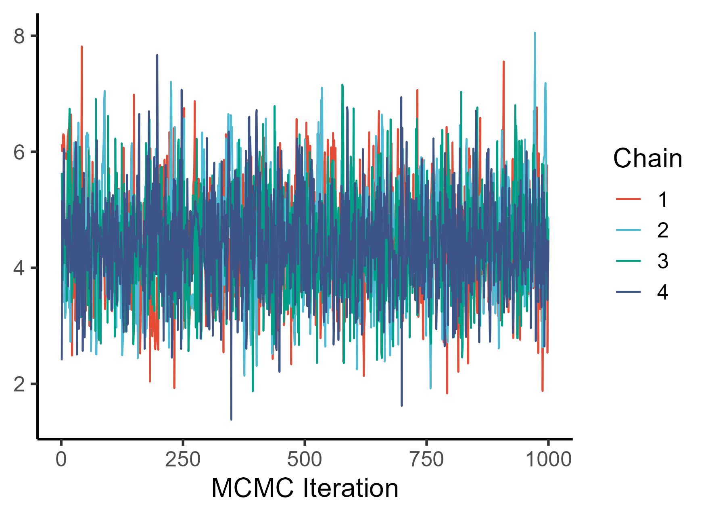

<!-- README.md is generated from README.Rmd. Please edit that file -->

```{r, include = FALSE}
knitr::opts_chunk$set(
  collapse = TRUE,
  comment = "#>",
  fig.path = "man/figures/README-",
  out.width = "100%"
)
```

# ADTGP

ADTGP uses Gaussian process regression to correct droplet-specific technical noise in single-cell protein sequencing data. It returns the expected protein expression level when all the cells have the same isotype control noise.


## Installation

ADTGP depends on cmdstanr to interact with Stan. Install them first before installing ADTGP with:

``` r
# First install cmdstanr and stan
install.packages("cmdstanr", repos = c("https://mc-stan.org/r-packages/", getOption("repos")))
cmdstanr::install_cmdstan()
cmdstanr::set_cmdstan_path()

# install.packages("devtools")
devtools::install_github("northNomad/ADTGP")
```

## Simulated Data

To run the same simulation as seen in the manuscript, use:

```{r eval=FALSE}
sim <- ADTGP_RunSimulation()
```

## Real World Example

Here, we use ADTGP to obtain the conditional distribution of CD11b counts where all cells share the same isotype control noise.

#### Step1: Prepare data and design matrix

```{r, eval=FALSE}
library(ADTGP)

# Load dataset
data("idh_pdx")
d <- idh_pdx

## Relevel treatment. 1 = vehicle; 2 = ivosidenib
d$Treatment <- ifelse(d$Treatment == "veh", 1, 2)

## Design matrix
dm <- matrix(nrow=nrow(d), ncol=2)
colnames(dm) <- c("mu0", "T")
dm[, "mu0"] <- 1
dm[, "T"] <- d$Treatment
```

#### Step2: Run ADTGP

```{r, eval=FALSE}
## Fit model for CD11b
f_CD11b <- ADTGP(igg=d$IgG1,
                 poi=d$CD11b,
                 design_matrix=dm,
                 iter_warmup=3e3,
                 iter_sampling=1e3)
```

#### Trace plot

```{r, eval=FALSE}
trace_cd11b <- f_CD11b$stanfit$draws(variables = "mu0")
trace_cd11b %>%
  as.data.frame() %>%
  mutate(iter=1:1000) %>%
  pivot_longer(1:4, names_to="chain", values_to="mu0") %>%
  ggplot(aes(x=iter, y=mu0,)) +
  geom_path(aes(color=chain)) +
  labs(x="MCMC Iteration", y=NULL) +
  scale_color_npg(name="Chain", labels=1:4) +
  theme_classic(15)
```



#### Overlay prior and posterior distribution of CD11b counts

```{r, eval=FALSE}
## Get prior distribution of count (50 draws)
m_prior <- ADTGP_prior(n=200L, igg=rep(0, 200))
index <- sample(1:4000, 50) 

## Downsample posterior distribution of count
posterior_counts <- f_CD11b$draws
posterior_counts <- posterior_counts[sample(1:nrow(posterior_counts), 200), ]

## Plot - CD11b expression prior and posterior
plot(NULL, xlim=c(0, 11), ylim=c(0, .2), xlab="log (n + 1)",
     ylab="Density", main="CD11b Expression")
for(i in index){
  lines(density(log(m_prior$draws[i, ] + 1)), col=col.alpha("black", .2))
}
lines(density(log(posterior_counts[, "T_rep_1"] + 1)), col="blue", lwd=2)
lines(density(log(posterior_counts[, "T_rep_2"] + 1)), col="firebrick", lwd=2)

```


